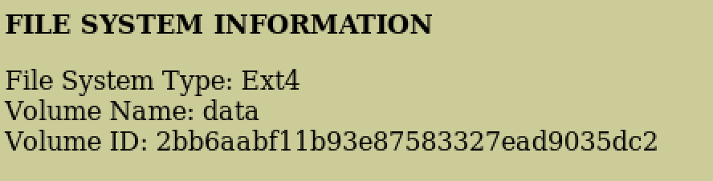
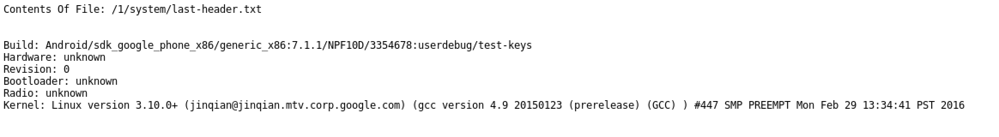
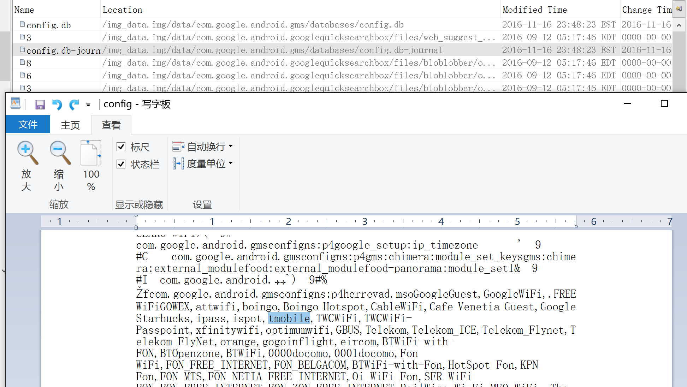
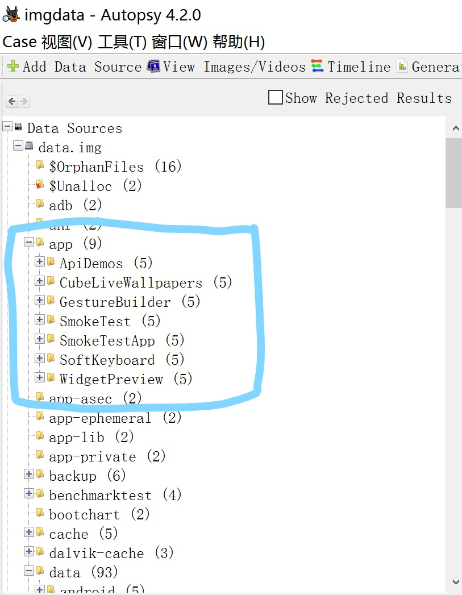
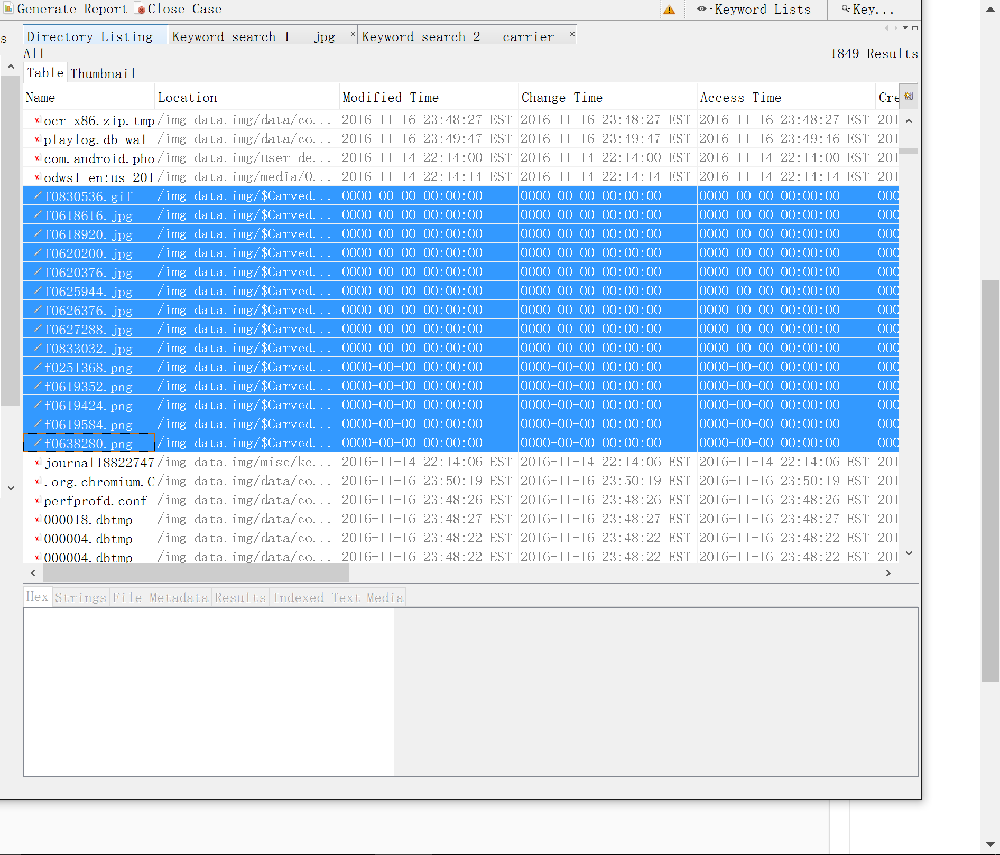

#Lab 8
######Alice Lee  (alee07)
######Xiaoyu Shi (xshi01)

1. What is the MD5 checksum of the disk image?

   b5484326d47e79e170a1b39e808d343f
    
2. What is/are the disk format(s) of the disk on the suspect's computing device?

   Ext4
   

3. What operating system, including version number, is being used? Please elaborate how you determined this information. Please provide any screenshots that support your findings.

   Linux version 3.10.0+
   

4. Is there a phone carrier involved? Please provide any screenshots that support your findings.

   T-Mobile is one of the regular connections in the log of internet connections. Other connections seem to be wifi connections.  
   

5. What applications are installed on the disk? Please elaborate how you determined this information. Please provide any screenshots that support your findings.

   We think that the applications in the /app folder ApiDemos, CubeLiveWallpapers, GestureBuilder, SmokeTest/SmoteTestApp, SoftKeyboard, and WidgetPrewiew, are installed on thr disk. 
   
   
   The applications under /data and named com.android.(application name), such as calculator and calendar, are pre-installed on the Android system.
   
6. List some of the incriminating evidence that you found. Please elaborate where did you find the evidence, and how you uncovered the evidence. Please submit any incriminating evidence.

   There is an email stating the suspect's intent to eat the celebrity in question, see email.pdf.

7. Did the suspect move or try to delete any files before his arrest? Please list the name(s) of the file(s) and any indications of their contents that you can find.

   The suspect removed all 14 images of the celebrity before his arrest. The list of all images are provided in the image below. The fact that they all have a timestamp of 0000-00-00 is the proof that the file pointers to these images are removed, but the data are not deleted.
   

8. Did the suspect save pictures of the celebrity? If so, how many pictures of the celebrity did you find? (including any deleted images). Please submit all the images that you have found.

   Yes, see images in the "kermits" directory; there are 15 kermit/frog-related photos. There are also images irrelevent to kermit, such as screenshots, that are not included in the directory.

9. Are there any encrypted files? If so, list the contents in the encrypted file and provide a brief description of how you decrypted the file. Please submit all the decrypted contents.

   Yes, there are two encrypted files in a folder called "lockbox" which were decrypted using the password "baseball" found using fcrackzip. These are included in folder "decrypted".

10. Who is the celebrity that the suspect has been stalking?

   Kermit the Frog
